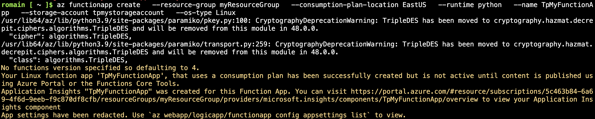

1. **Installer les outils Azure Functions Core Tools**

 Installer Node.js :
```bash
brew install node
```

Installer Azure Functions Core Tools :
```bash
brew tap azure/functions
brew install azure-functions-core-tools@4
```

2. **Créer un projet Azure Function localement**

Initialiser un nouveau projet Azure Functions avec Python comme langage de programmation :
```bash
func init MyFunctionProj --python
```

Naviguer dans le répertoire du projet :
```bash
cd MyFunctionProj
```

Créer une nouvelle fonction HTTP déclenchée :
```bash
func new --name HelloWorldFunction --template "HTTP trigger" --authlevel "anonymous"
```

3. **Tester et déployer la fonction**

Démarrer la fonction localement :
```bash
func start
```

Exemple:
```bash
curl http://localhost:7071/api/HelloWorldFunction
```

4. **Déployer la fonction sur Azure**



Créer une Function App dans Azure :
```bash
az functionapp create \
  --resource-group myResourceGroup \
  --consumption-plan-location EastUS \
  --runtime python \
  --name MyFunctionApp \
  --storage-account mystorageaccount
```

Déployer la fonction sur Azure :
```bash
func azure functionapp publish MyFunctionApp
```

Tester la connexion:
```bash
curl https://myfunctionapp.azurewebsites.net/api/HelloWorldFunction
```

5. **Tester la fonction avec l'intégration Azure Storage**

Exécuter et tester
```bash
curl https://myfunctionapp.azurewebsites.net/api/HelloWorldFunction
```
