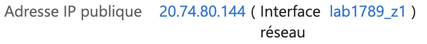
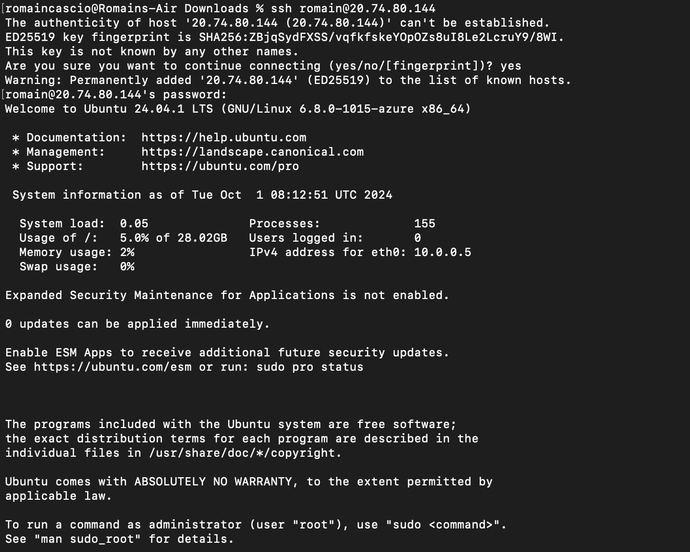
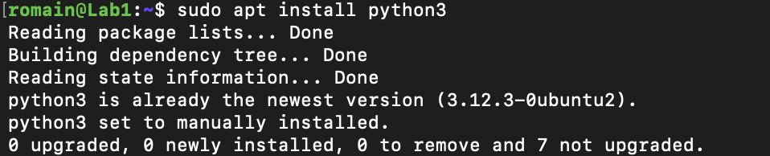

# Lab 1: Creating and Managing Azure Virtual Machines

1. **Déployer une machine virtuelle Windows et Linux dans Azure et Configurer la taille des VMs, les options de stockage et les paramètres réseau**



- Commande équivalente (Azure CLI)

```bash
az vm create --resource-group myResourceGroup --name <nom_vm> --image UbuntuLTS --admin-username azureuser --admin-password myPassword123
```

2. **Se connecter aux VMs via RDP (Windows) et SSH (Linux)**





- Commande équivalente (Azure CLI)

Le package est deja installé par defaut mais la logique reste la meme pour d'autres packages.

```bash
sudo apt update && sudo apt install python3
```
