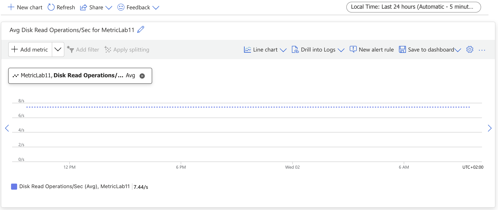

# Lab 11: Implementing Azure Monitor and Alerts

1. **Configurer Azure Monitor pour collecter des métriques**



- Commande équivalente (Azure CLI)

```bash
az monitor diagnostic-settings create \
  --resource-group myResourceGroup \
  --name "MetricLab11" \
  --resource $VM_NAME \
  --metrics '[{"category": "AllMetrics", "enabled": true}]' \
  --logs '[{"category": "AuditEvent", "enabled": true}]'
```

2. **Créer des alertes basées sur les métriques des ressources**


- Commande équivalente (Azure CLI)

```bash
az monitor metrics alert create \
  --name "Cpu alert max" \
  --resource-group $RESOURCE_GROUP \
  --scopes "/subscriptions/<subscription_id>/resourceGroups/$RESOURCE_GROUP/providers/Microsoft.Compute/virtualMachines/$VM_NAME" \
  --condition "avg $METRIC_NAME > $THRESHOLD" \
  --description "Alerte si l'utilisation du CPU dépasse 80%" \
  --window-size 5m \
  --evaluation-frequency 1m
```

3. **Visualiser les données à l'aide des tableaux de bord Azure**


- Commande équivalente (Azure CLI)

```bash
az portal dashboard create --resource-group $RESOURCE_GROUP --name $DASHBOARD_NAME
```

4. **Mettre en œuvre des groupes d'actions pour les notifications d'alertes**


- Commande équivalente (Azure CLI)

```bash
az monitor action-group create \
  --resource-group myResourceGroup \
  --name $ACTION_GROUP_NAME \
  --short-name "myAG" \
  --action email myEmailAction $EMAIL_ADDRESS
```
