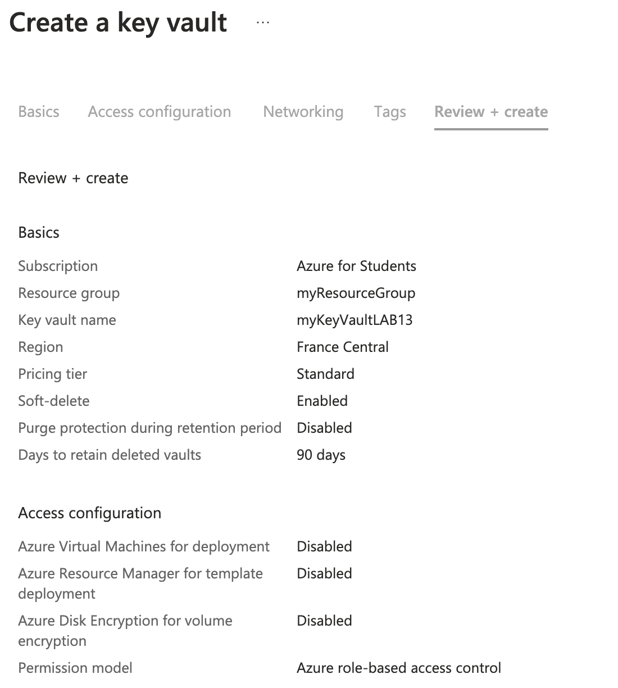

# Lab 13: Implementing Azure Key Vault

1. **Créer un Azure Key Vault**


- Commande équivalente (Azure CLI)

```bash
az keyvault create \
  --name $VAULT_NAME \
  --resource-group $RESOURCE_GROUP \
  --location $LOCATION \
  --sku standard
```

2. **Stocker et récupérer des secrets, des clés, et des certificats**

- Commande équivalente (Azure CLI)

Stocker un secret :
```bash
az keyvault secret set \
  --vault-name $VAULT_NAME \
  --name "MySecret" \
  --value "SuperSecretValue"
```
Récupérer un secret :
```bash
az keyvault secret show \
  --vault-name $VAULT_NAME \
  --name "MySecret"
```
Stocker une clé :
```bash
az keyvault key create \
  --vault-name $VAULT_NAME \
  --name "MyKey" \
  --protection software
```
Récupérer une clé :
```bash
az keyvault key show \
  --vault-name $VAULT_NAME \
  --name "MyKey"
```

3. **Intégrer Key Vault avec une application pour la gestion des secrets**

Installer le SDK Azure Key Vault :
```bash
pip install azure-identity azure-keyvault-secrets
```

Exemple de code pour récupérer un secret depuis Key Vault :
```bash
from azure.identity import DefaultAzureCredential
from azure.keyvault.secrets import SecretClient

# Variables
keyVaultName = "myKeyVault"
KVUri = f"https://{keyVaultName}.vault.azure.net"

# Authentification via Azure Identity
credential = DefaultAzureCredential()
client = SecretClient(vault_url=KVUri, credential=credential)

# Récupérer un secret
secret_name = "MySecret"
retrieved_secret = client.get_secret(secret_name)

print(f"Secret: {retrieved_secret.value}")
```

4. **Configurer des politiques d'accès et activer la surveillance**

- Commande équivalente (Azure CLI)

Ajouter une politique d'accès :
```bash
az keyvault set-policy \
  --name $VAULT_NAME \
  --upn "<user_principal_name>" \
  --secret-permissions get list
```

Activer la surveillance :
```bash
az monitor diagnostic-settings create \
  --resource $VAULT_NAME \
  --name "KeyVaultDiagnostics" \
  --logs '[{"category": "AuditEvent", "enabled": true}]' \
  --workspace "/subscriptions/<subscription_id>/resourceGroups/<resource_group>/providers/Microsoft.OperationalInsights/workspaces/<workspace_name>"
```

5. **Utiliser une clé ou un secret dans une application**

- Commande équivalente (Azure CLI)

Stocker un mot de passe de base de données dans Key Vault :
```bash
az keyvault secret set \
  --vault-name $VAULT_NAME \
  --name "DBPassword" \
  --value "MySecurePassword123"
```

```bash
# Utiliser le secret pour configurer une base de données
db_password = client.get_secret("DBPassword").value
```