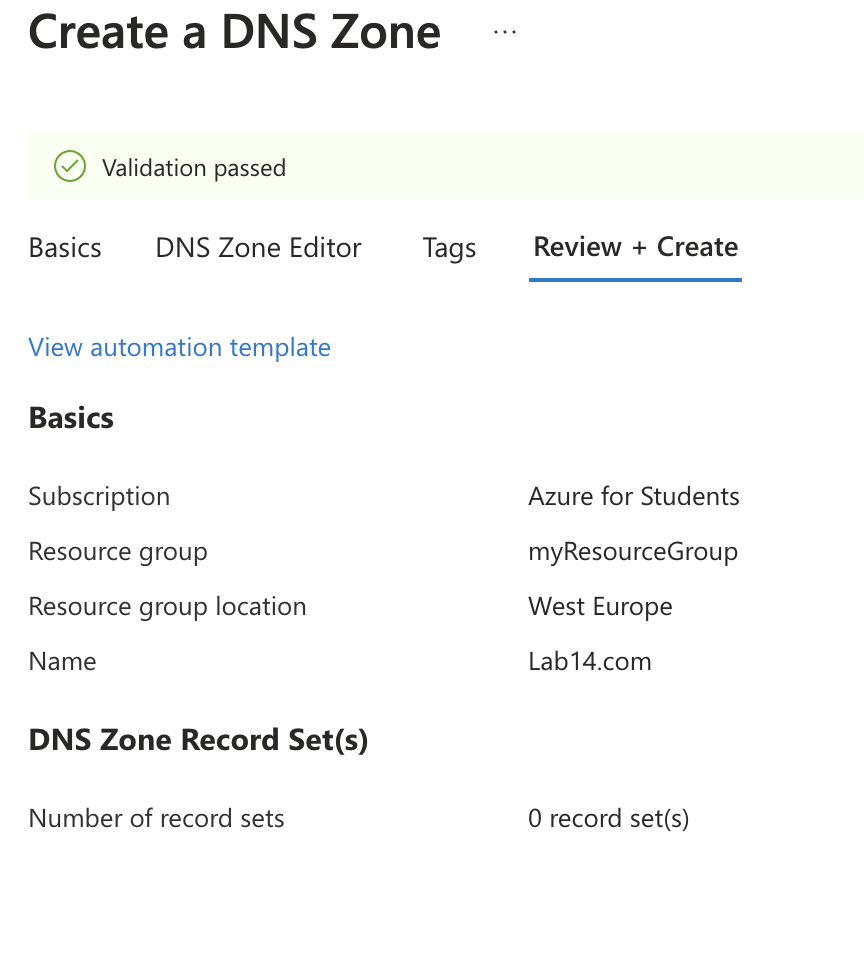
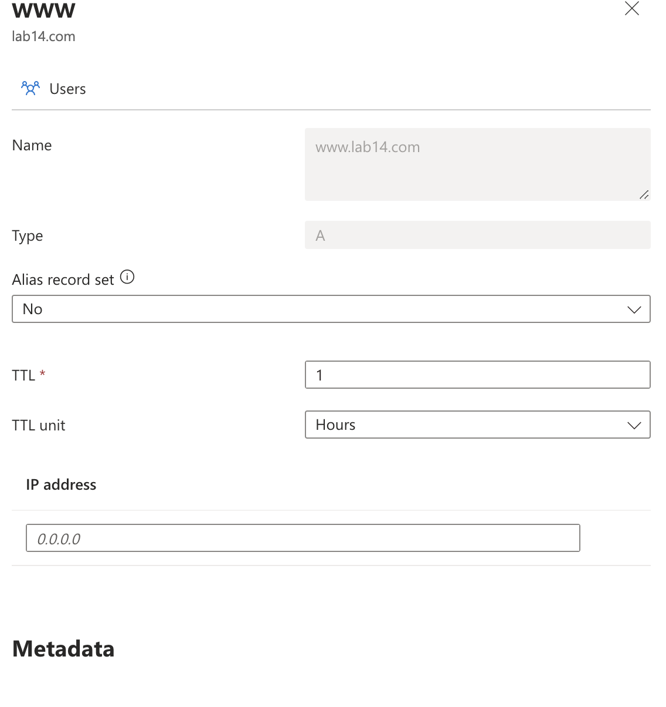

# Lab 14: Configuring Azure DNS and Custom Domains

1. **Créer une zone DNS Azure**



- Commande équivalente (Azure CLI)

```bash
az network dns zone create \
  --resource-group $RESOURCE_GROUP \
  --name $DNS_ZONE
```

2. **Gérer les enregistrements DNS pour un domaine personnalisé**



- Commande équivalente (Azure CLI)

Créer un enregistrement A (pour mapper un sous-domaine www à une adresse IP) :
```bash
az network dns record-set a add-record \
  --resource-group $RESOURCE_GROUP \
  --zone-name $DNS_ZONE \
  --record-set-name "www" \
  --ipv4-address "123.123.123.123"
```

Créer un enregistrement CNAME (pour mapper un sous-domaine à un autre domaine) :
```bash
az network dns record-set cname set-record \
  --resource-group $RESOURCE_GROUP \
  --zone-name $DNS_ZONE \
  --record-set-name "www" \
  --cname "myapp.azurewebsites.net"
```

3. **Configurer la vérification de domaine et le mappage pour les services Azure**


