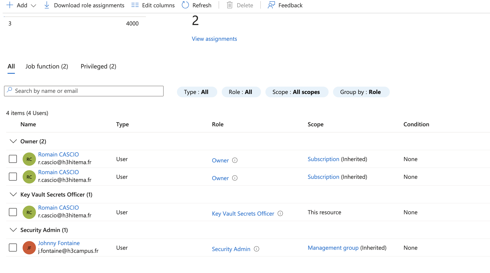
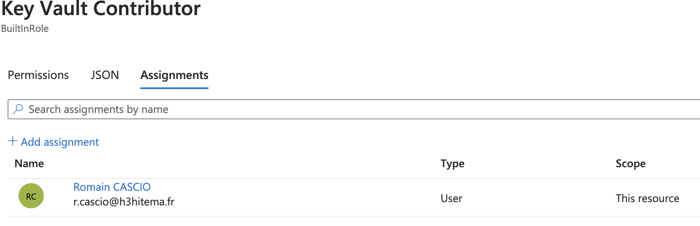
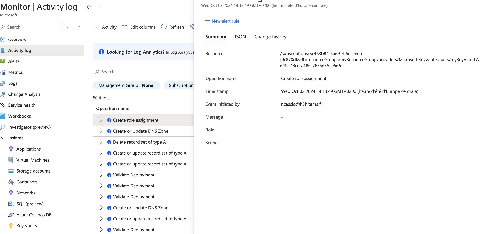

# Lab 16: Managing Role-Based Access Control (RBAC)

1. **Attribuer des rôles intégrés (built-in roles) aux utilisateurs et aux groupes**



- Commande équivalente (Azure CLI)

```bash
az role assignment create \
  --assignee $USER_PRINCIPAL_NAME \
  --role $ROLE \
  --resource-group $RESOURCE_GROUP
```
2. **Créer des rôles personnalisés avec des permissions spécifiques**



- Commande équivalente (Azure CLI)

Créer un fichier JSON pour définir le rôle personnalisé :

```bash
{
  "Name": "Custom Reader",
  "Description": "Can read resources but cannot make changes",
  "Actions": [
    "Microsoft.Compute/virtualMachines/read",
    "Microsoft.Network/networkInterfaces/read"
  ],
  "AssignableScopes": ["/subscriptions/<subscription_id>/resourceGroups/myResourceGroup"]
}
```

Créer le rôle personnalisé avec Azure CLI :
```bash
az role definition create --role-definition customRole.json
```

3. **Tester les niveaux d'accès pour différents rôles**

Via l'interface graphique tester en se connectant avec le compte utilisateur.

Tester via Azure CLI :
```bash
az vm list --resource-group myResourceGroup --output table
```

4. **Auditer l'accès en utilisant les journaux d'activité**



- Commande équivalente (Azure CLI)

Afficher les journaux d'activité pour un groupe de ressources :
```bash
az monitor activity-log list \
  --resource-group myResourceGroup \
  --output table
```

Filtrer les journaux pour afficher les erreurs ou les échecs d'accès :
```bash
az monitor activity-log list \
  --resource-group myResourceGroup \
  --status Failed \
  --output table
```

