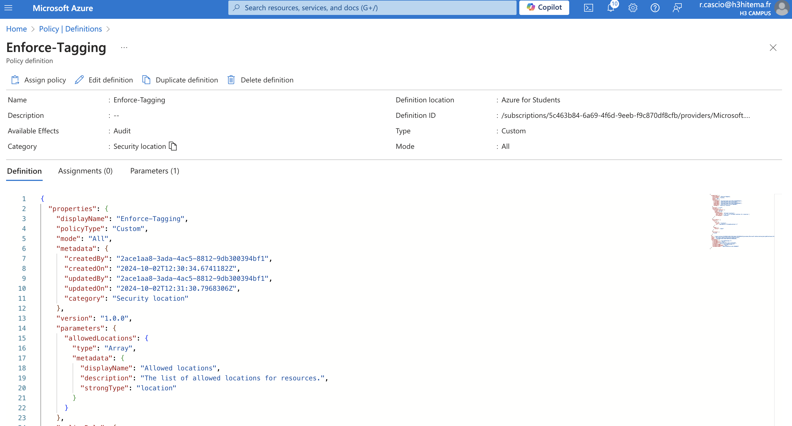
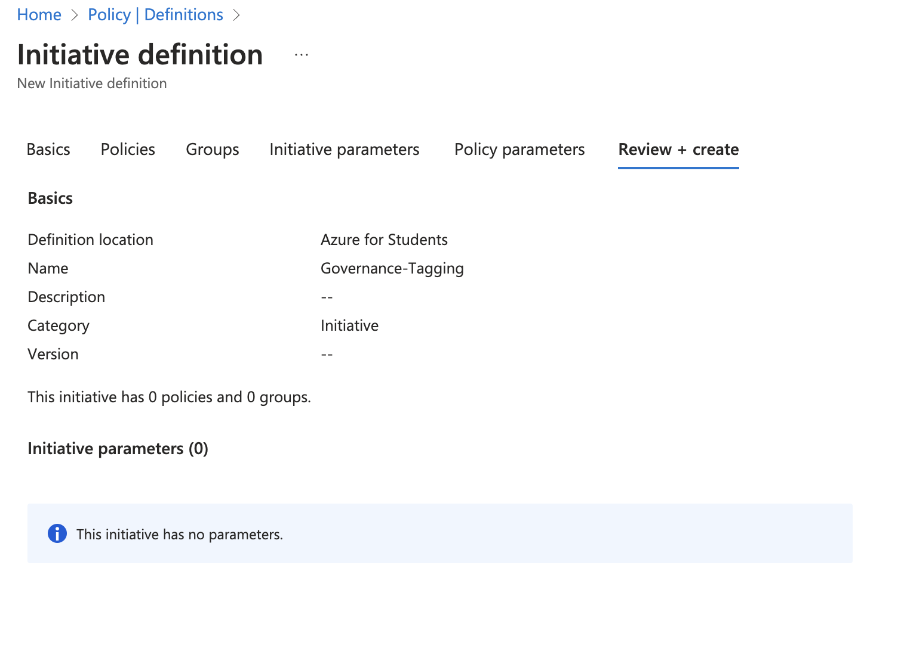
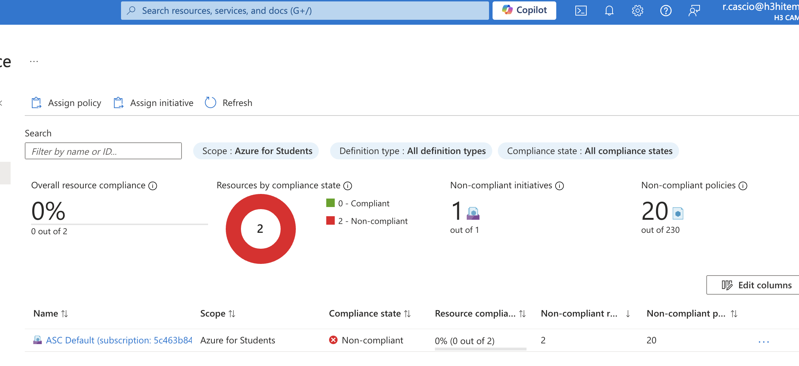

# Lab 17: Implementing Azure Policy and Governance

1. **Créer et assigner des Azure Policies pour assurer la conformité**



- Commande équivalente (Azure CLI)

```bash
az policy definition create \
  --name "RequireTag" \
  --rules policy.json \
  --description "Enforce that resources have a specific tag" \
  --display-name "Require Tag on Resources"
```

2. **Utiliser des initiatives pour regrouper plusieurs politiques**



- Commande équivalente (Azure CLI)

```bash
az policy set-definition create \
  --name "GovernanceTagging" \
  --definitions initiative.json \
  --description "Ensure all resources have proper tags"
```

3. **Remédier aux ressources non conformes**

Pour corriger les ressources non conformes, sélectionne une ressource et la corriger.



- Commande équivalente (Azure CLI)
```bash
az policy remediation create \
  --name "RemediateTags" \
  --policy-assignment "EnforceTagging" \
  --resource-group "myResourceGroup"
```

4. **Analyser les rapports de conformité**

Analyser les rapports
```bash
az policy state list \
  --policy-assignment "EnforceTagging" \
  --resource-group "myResourceGroup" \
  --output table
```
