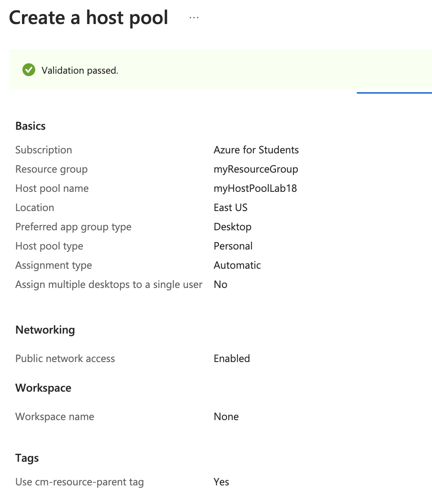
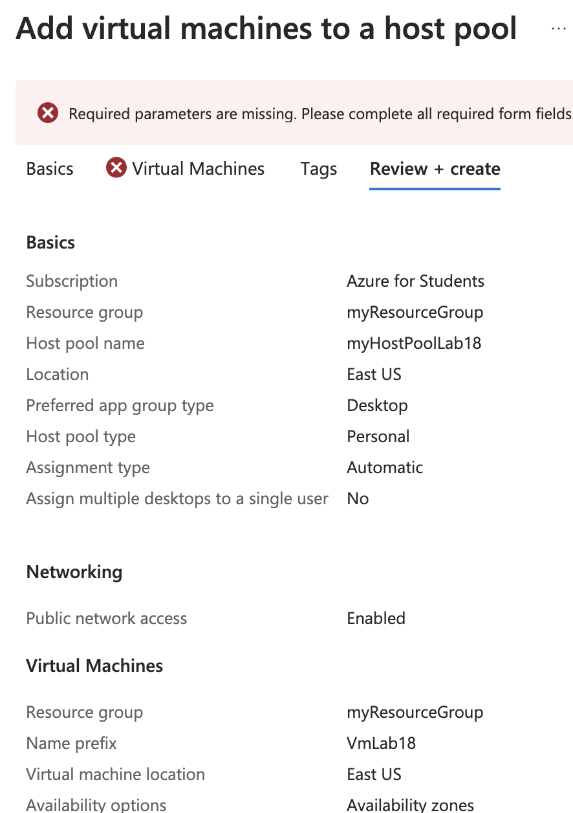

# Lab 18: Configuring Azure Virtual Desktop

1. **Mettre en place un environnement Azure Virtual Desktop**



- Commande équivalente (Azure CLI)

```bash
az desktopvirtualization hostpool create \
  --resource-group $RESOURCE_GROUP \
  --name $HOST_POOL_NAME \
  --location $LOCATION \
  --custom-rdp-property "drivestoredirect:s:*;" \
  --load-balancer-type "BreadthFirst"
```

2. **Configurer les pools d'hôtes, les hôtes de session et les espaces de travail**



- Commande équivalente (Azure CLI)

```bash
az desktopvirtualization workspace create \
  --resource-group $RESOURCE_GROUP \
  --name "myWorkspace" \
  --location $LOCATION

az desktopvirtualization hostpool add \
  --resource-group $RESOURCE_GROUP \
  --host-pool-name $HOST_POOL_NAME \
  --workspace-name "myWorkspace"
```

3. **Publier des applications de bureau à distance**

```bash
az desktopvirtualization application create \
  --resource-group $RESOURCE_GROUP \
  --host-pool-name $HOST_POOL_NAME \
  --name "WordApp" \
  --app-name "Microsoft Word" \
  --file-path "C:\\Program Files\\Microsoft Office\\root\\Office16\\WINWORD.EXE"
```

4. **Se connecter aux bureaux virtuels en tant qu'utilisateur**

- Se connecter à Azure Virtual Desktop via le client Remote Desktop.