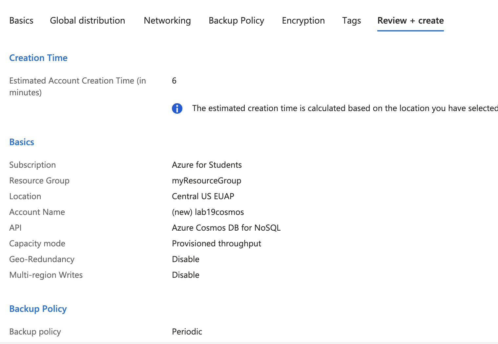
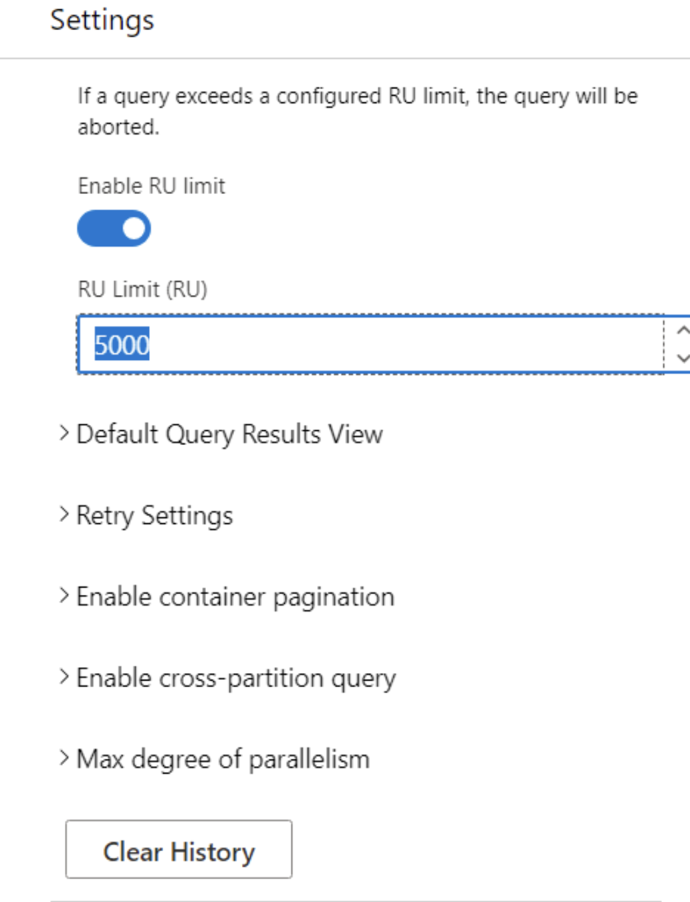

# Lab 19: Implementing Azure Cosmos DB

1. **Créer un compte Azure Cosmos DB avec une API choisie**



- Commande équivalente (Azure CLI)

```bash
az cosmosdb create \
  --name $COSMOS_ACCOUNT \
  --resource-group $RESOURCE_GROUP \
  --locations regionName=$LOCATION \
  --default-consistency-level "Session" \
  --capabilities EnableServerless
```

2. **Insérer et interroger des données à l'aide de Data Explorer**

- Commande équivalente (Azure CLI)

```bash
az cosmosdb sql database create \
  --account-name $COSMOS_ACCOUNT \
  --resource-group $RESOURCE_GROUP \
  --name myDatabase
```

3. **Configurer le débit et le partitionnement**



- Commande équivalente (Azure CLI)

```bash
az cosmosdb sql container throughput update \
  --account-name $COSMOS_ACCOUNT \
  --resource-group $RESOURCE_GROUP \
  --database-name myDatabase \
  --name myContainer \
  --throughput 1000
```

4. **Mettre en œuvre la distribution globale**

```bash
az cosmosdb update \
  --name $COSMOS_ACCOUNT \
  --resource-group $RESOURCE_GROUP \
  --locations regionName=EastUS failoverPriority=0 \
  --locations regionName=WestEurope failoverPriority=1
```