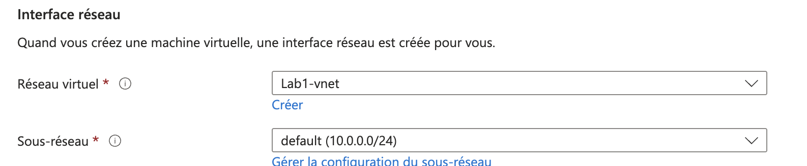
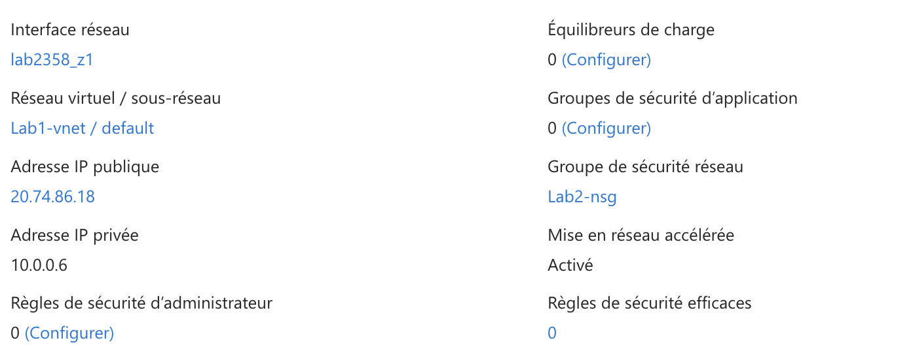
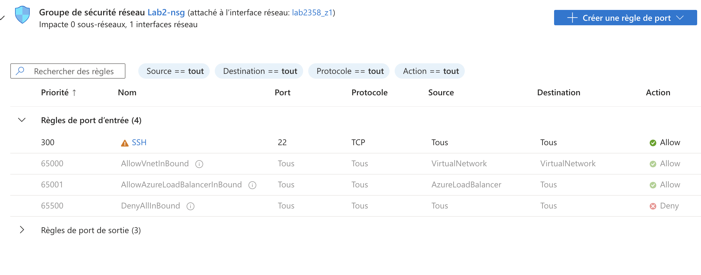
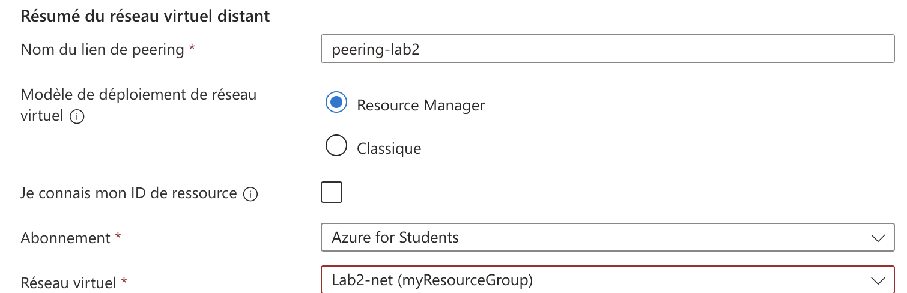

# Lab 2: Implementing Azure Virtual Networks

1. **Création d'un VNet avec plusieurs sous-réseaux**





- Commande équivalente (Azure CLI)

```bash
az network vnet create \
  --name <name> \
  --resource-group <nom_du_groupe> \
  --address-prefix 10.0.0.0/16 \
  --subnet-name Subnet1 \
  --subnet-prefix 10.0.1.0/24
```

```bash
az network vnet subnet create \
  --vnet-name VNet-Lab2 \
  --name <name> \
  --address-prefix 10.0.2.0/24 \
  --resource-group <nom_du_groupe>
```

2. **Déploiement de VMs dans des sous-réseaux spécifiques**




- Commande équivalente (Azure CLI)

```bash
az vm create \
  --resource-group <nom_du_groupe> \
  --name VM-Subnet1 \
  --image UbuntuLTS \
  --admin-username <nom_utilisateur> \
  --authentication-type ssh \
  --ssh-key-value <clé_publique_ssh> \
  --vnet-name VNet-Lab2 \
  --subnet Subnet1
```

```bash
az vm create \
  --resource-group <nom_du_groupe> \
  --name VM-Subnet2 \
  --image UbuntuLTS \
  --admin-username <nom_utilisateur> \
  --authentication-type ssh \
  --ssh-key-value <clé_publique_ssh> \
  --vnet-name VNet-Lab2 \
  --subnet Subnet2
```
