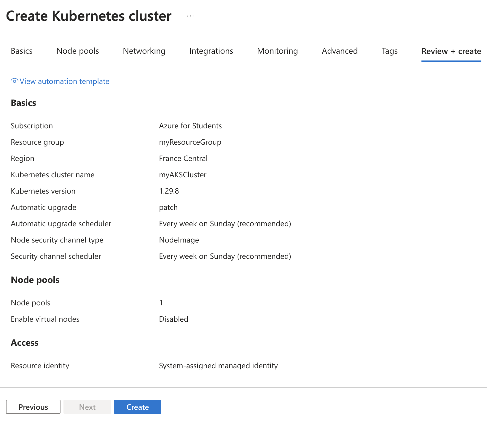
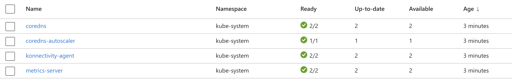

# Lab 20: Deploying Azure Kubernetes Service

1. **Configurer un cluster AKS**



- Commande équivalente (Azure CLI)

```bash
az aks create \
  --resource-group myResourceGroup \
  --name myAKSCluster \
  --node-count 3 \
  --enable-addons monitoring \
  --generate-ssh-keys
```

2. **Déployer une application conteneurisée à l'aide de manifests Kubernetes**

Créer ou télécharger un fichier yaml.

- Commande équivalente (Azure CLI)

```bash
apiVersion: apps/v1
kind: Deployment
metadata:
  name: nginx-deployment
spec:
  replicas: 2
  selector:
    matchLabels:
      app: nginx
  template:
    metadata:
      labels:
        app: nginx
    spec:
      containers:
      - name: nginx
        image: nginx:latest
        ports:
        - containerPort: 80
```

3. **Mettre à l'échelle les applications et gérer les pods**



- Commande équivalente (Azure CLI)

```bash
kubectl scale deployment nginx-deployment --replicas=5
```

4. **Mettre en œuvre des politiques réseau (Network Policies) pour gérer la communication des pods**

Crée un fichier network-policy.yaml pour définir une politique qui autorise uniquement certains pods à communiquer entre eux.

```bash
apiVersion: networking.k8s.io/v1
kind: NetworkPolicy
metadata:
  name: allow-nginx-traffic
spec:
  podSelector:
    matchLabels:
      app: nginx
  policyTypes:
  - Ingress
  ingress:
  - from:
    - podSelector:
        matchLabels:
          app: allowed-app
    ports:
    - protocol: TCP
      port: 80
```

Déployer la politique réseau :
```bash
kubectl apply -f network-policy.yaml
```

Vérifier la politique réseau :
```bash
kubectl get networkpolicy
```