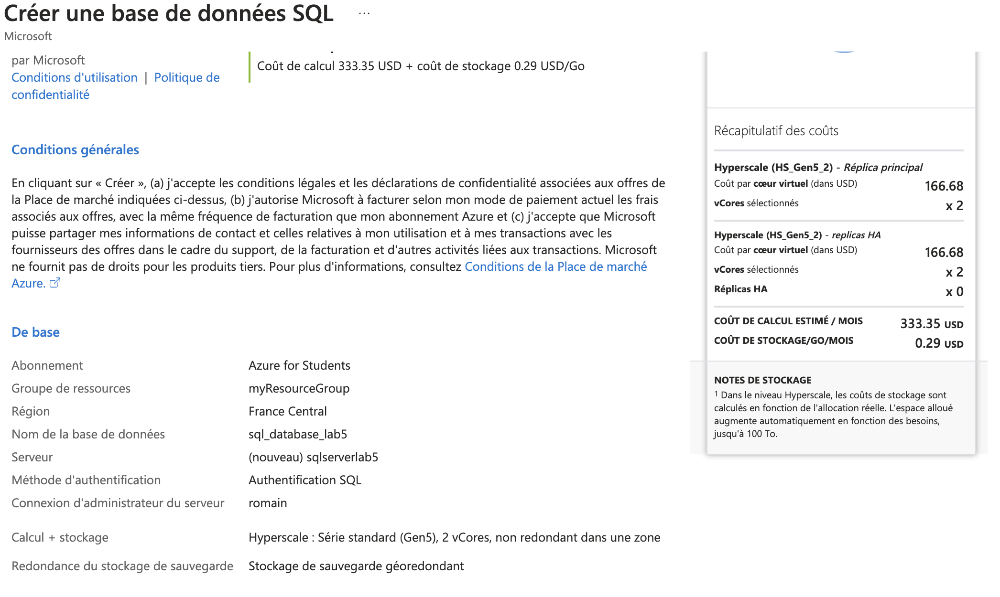
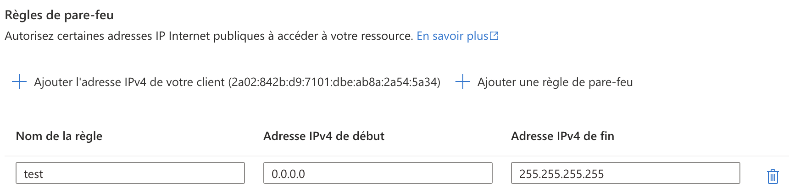
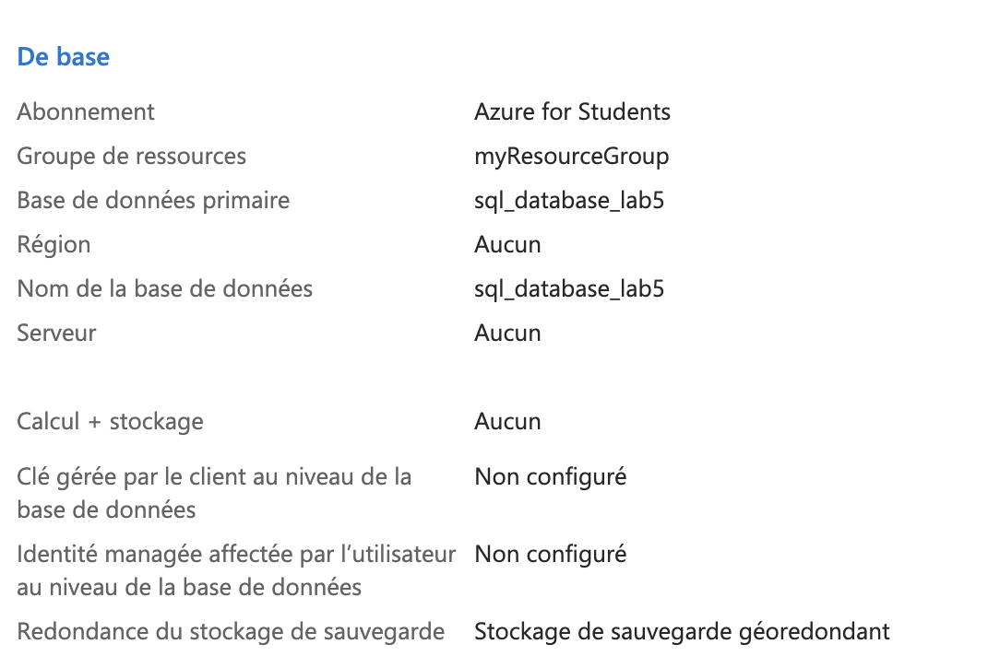

# Lab 5: Implementing Azure SQL Databases

1. **Déployer une instance SQL Azure**



- Commande équivalente (Azure CLI)
```bash
az sql db create \
  --resource-group <nom_du_groupe> \
  --name sql_database_lab5 \
  --server sqlserverlab5 \
  --edition Basic
```

*si pas de server sql alors il faut le créer*

```bash
az sql server create \
  --name $SQL_SERVER_NAME \
  --resource-group $RESOURCE_GROUP \
  --location $LOCATION \
  --admin-user $ADMIN_USER \
  --admin-password $ADMIN_PASSWORD
```

2. **Configurer les paramètres de pare-feu**



- Commande équivalente (Azure CLI)
```bash
az sql server firewall-rule create \
  --resource-group <nom_du_groupe> \
  --server sqlserverlab5 \
  --name test (nom de test) \
  --start-ip-address <adresse_ip> \
  --end-ip-address <adresse_ip>
```

3. **Importer des données dans la base de données**



- Commande équivalente (Azure CLI)
```bash
CREATE TABLE Employees (
  EmployeeID INT PRIMARY KEY,
  FirstName NVARCHAR(50),
  LastName NVARCHAR(50),
  HireDate DATE
);

INSERT INTO Employees (EmployeeID, FirstName, LastName, HireDate)
VALUES (1, 'John', 'Doe', '2020-01-01');
```

```bash
az sql db import \
  --resource-group $RESOURCE_GROUP \
  --server $SQL_SERVER_NAME \
  --name mySQLDatabase \
  --admin-user $ADMIN_USER \
  --admin-password $ADMIN_PASSWORD \
  --storage-uri https://mystorageaccount.blob.core.windows.net/mycontainer/mydb.bacpac \
  --storage-key-type StorageAccessKey \
  --storage-key <storage-account-key>
```

4. **Mettre en œuvre la géo-réplication pour la haute disponibilité**

- Commande équivalente (Azure CLI)
```bash
az sql db replica create \
  --resource-group $RESOURCE_GROUP \
  --server sqlserverlab5 \
  --name sql_database_lab5 \
  --partner-server mySQLServerSecondary \
  --partner-resource-group $RESOURCE_GROUP \
  --location $SECONDARY_LOCATION
```