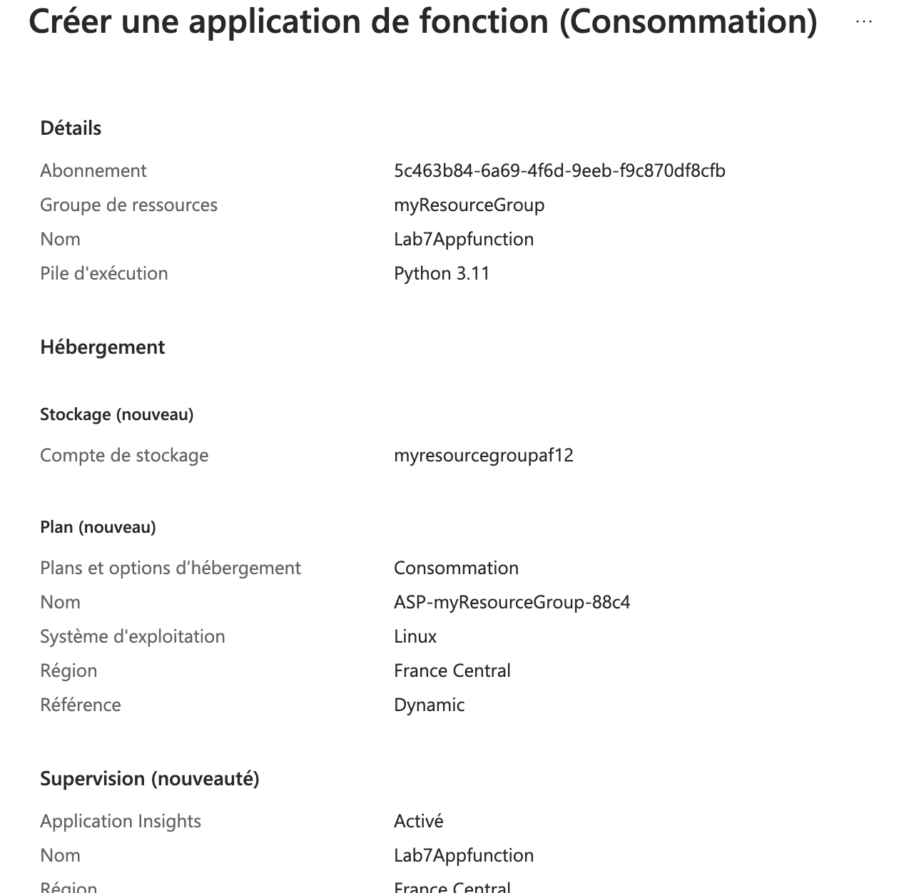
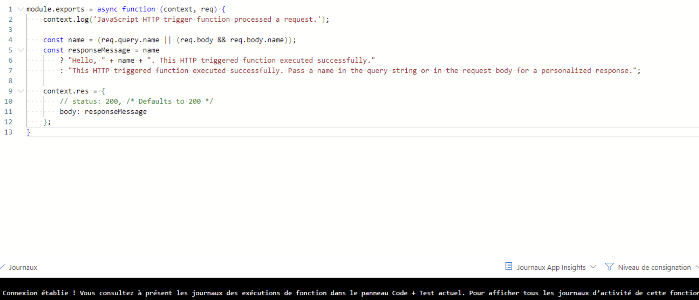
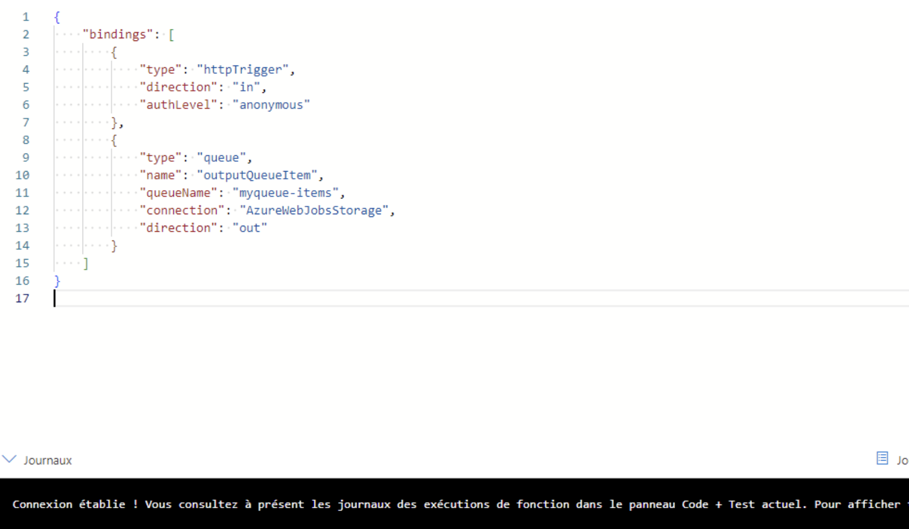
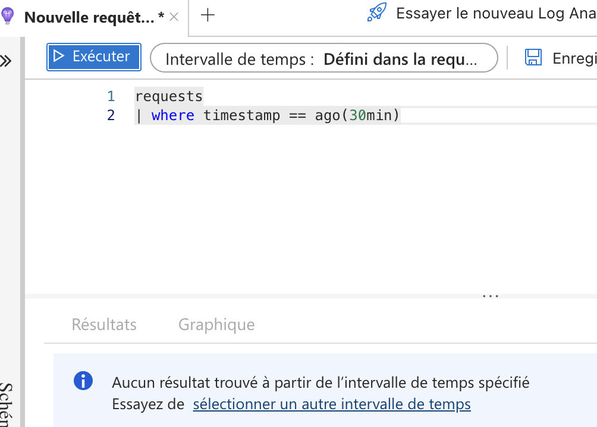

# Lab 7: Implementing Azure Functions

1. **Créer une application de fonction Azure (Azure Function App)**



- Commande équivalente (Azure CLI)
```bash
# Créer l'application de fonction
az functionapp create \
  --resource-group $RESOURCE_GROUP \
  --consumption-plan-location $LOCATION (prendre canada sinon pas possible)\
  --name lab7appfunction \
  --storage-account $STORAGE_ACCOUNT_NAME \
  --runtime $RUNTIME \
  --os-type $OS_TYPE
```

2. **Développer une fonction sans serveur déclenchée par une requête HTTP**



- Commande pour créer une fonction HTTP :
```bash
    func new --template "HTTP trigger" --name HttpTriggerFunction
```

3. **Intégration avec Azure Storage**



- Commande pour créer une fonction avec un déclencheur de file d'attente :
```bash
    func new --template "Azure Queue Storage trigger" --name myqeu-Items
```

4. **Surveillance des performances et journaux**



- Commande pour afficher les journaux en direct :
```bash
    az functionapp log stream --name Lab7Appfunction --resource-group myResourceGroup
```