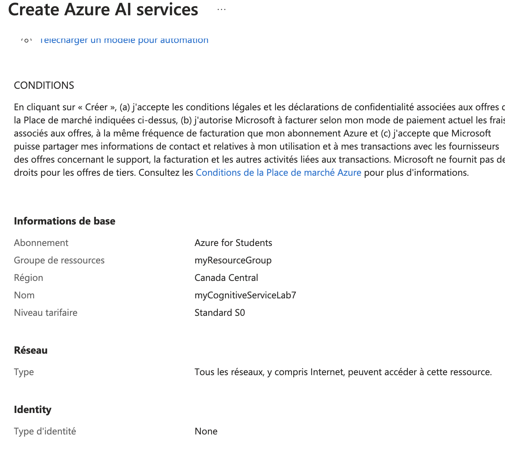

# Lab 8: Using Azure Cognitive Services

1. **Créer une ressource Azure Cognitive Services**



- Commande équivalente (Azure CLI)

```bash
az cognitiveservices account create \
  --name myCognitiveServiceLab7 \
  --resource-group $RESOURCE_GROUP \
  --kind TextAnalytics \
  --sku S0 \
  --location canada \
  --yes
```

2. **Développer une application qui utilise l'API Text Analytics**

*Voici un exemple de code Python pour utiliser l'API Text Analytics*

- Installer le SDK Azure pour Text Analytics
```bash
pip install azure-ai-textanalytics
```

```bash
from azure.ai.textanalytics import TextAnalyticsClient
from azure.core.credentials import AzureKeyCredential

# Clé API et point de terminaison (endpoint)
key = "YOUR_COGNITIVE_SERVICE_KEY"
endpoint = "https://YOUR_COGNITIVE_SERVICE_NAME.cognitiveservices.azure.com/"

# Fonction pour authentifier le client
def authenticate_client():
    ta_credential = AzureKeyCredential(key)
    text_analytics_client = TextAnalyticsClient(
        endpoint=endpoint, credential=ta_credential)
    return text_analytics_client

# Analyser les sentiments
def analyze_sentiment(client, documents):
    response = client.analyze_sentiment(documents=documents)[0]
    print(f"Document sentiment: {response.sentiment}")
    print(f"Overall scores: positive={response.confidence_scores.positive}; neutral={response.confidence_scores.neutral}; negative={response.confidence_scores.negative}")

# Extraire les phrases clés
def extract_key_phrases(client, documents):
    response = client.extract_key_phrases(documents=documents)[0]
    print(f"Key phrases: {response.key_phrases}")

# Tester l'application
client = authenticate_client()
documents = ["Je suis très content de mon nouveau produit !"]

# Analyser les sentiments
analyze_sentiment(client, documents)

# Extraire les phrases clés
extract_key_phrases(client, documents)
```

3. **Analyser le sentiment et les phrases clés à partir de texte**

- Exemple d'analyse de sentiment :
```bash
Si le texte d'entrée est : "Je suis très content de mon nouveau produit !", l'analyse des sentiments retournera positif
```

- Exemple d'extraction de phrases clés :
```bash
Si le texte d'entrée est : "Je suis très content de mon nouveau produit !", l'extraction des phrases clés retournera : ["nouveau produit"]
```

4. **Gérer les clés API**

- Commandes utilisées pour gérer les clés API :
```bash
az cognitiveservices account keys list --name myCognitiveService --resource-group myResourceGroup
```