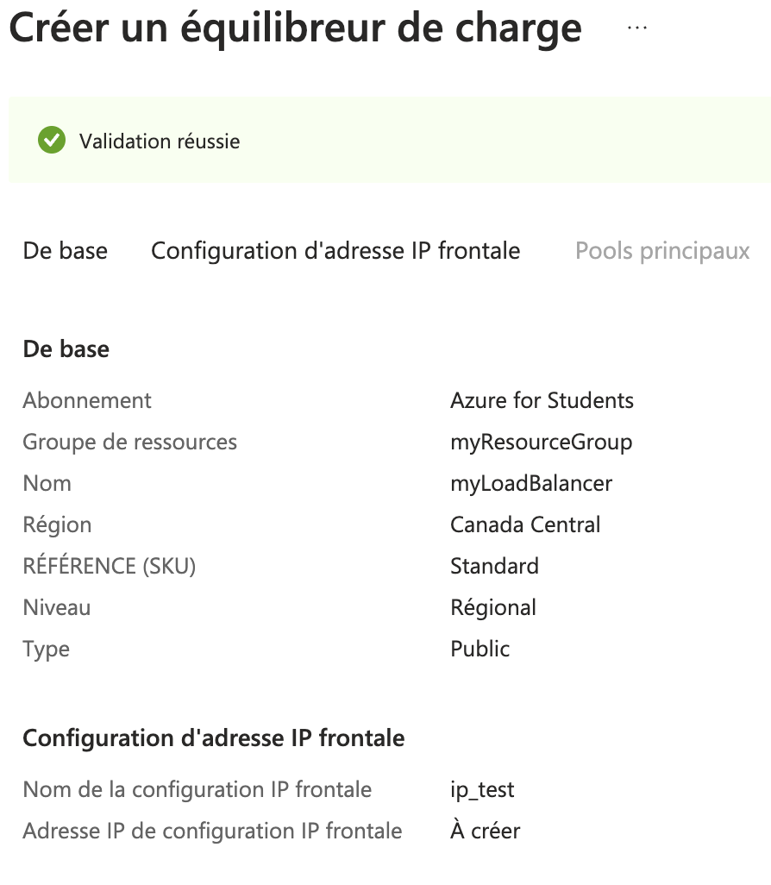
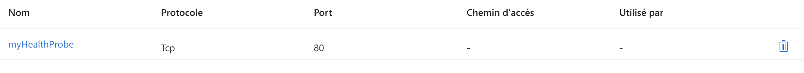
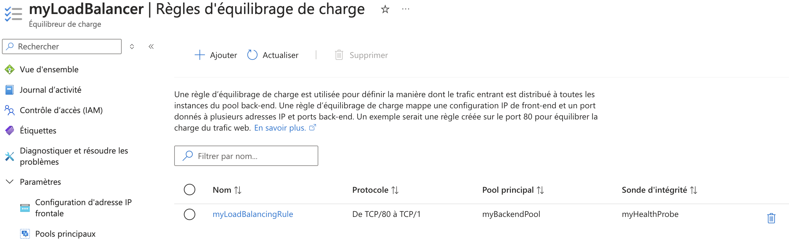

# Lab 9: Implementing Azure Load Balancer and Traffic Manager

1. **Déployer un Azure Load Balancer pour répartir le trafic entre plusieurs VMs**



- Commande équivalente (Azure CLI)

```bash
# Créer une adresse IP publique
az network public-ip create \
  --resource-group $RESOURCE_GROUP \
  --name $PUBLIC_IP_NAME \
  --allocation-method Static \
  --sku Standard

# Créer le Load Balancer public
az network lb create \
  --resource-group $RESOURCE_GROUP \
  --name $LB_NAME \
  --frontend-ip-name myFrontendIP \
  --public-ip-address $PUBLIC_IP_NAME \
  --location $LOCATION
```

2. **Configurer les probes de santé et les règles d'équilibrage**



- Commande équivalente (Azure CLI)

```bash
az network lb probe create \
  --resource-group myResourceGroup \
  --lb-name myLoadBalancer \
  --name HealthProbeLab9 \
  --protocol tcp \
  --port 80 \
  --path /

az network lb rule create \
  --resource-group myResourceGroup \
  --lb-name myLoadBalancer \
  --name myLoadBalancingRule \
  --protocol tcp \
  --frontend-port 80 \
  --backend-port 80 \
  --frontend-ip-name myFrontendIP \
  --backend-pool-name myBackendPool \
  --probe-name myHealthProbe
```

3. **Configurer Azure Traffic Manager**



- Commande équivalente (Azure CLI)

```bash
az network lb address-pool create \
  --resource-group myResourceGroup \
  --lb-name myLoadBalancer \
  --name myBackendPool

az network nic ip-config address-pool add \
  --address-pool myBackendPool \
  --ip-config-name ipconfig1 \
  --nic-name myVMNic1 \
  --resource-group myResourceGroup \
  --lb-name myLoadBalancer

az network lb rule create \
  --resource-group myResourceGroup \
  --lb-name myLoadBalancer \
  --name myLoadBalancingRule \
  --protocol tcp \
  --frontend-port 80 \
  --backend-port 80 \
  --frontend-ip-name myFrontendIP \
  --backend-pool-name myBackendPool \
  --probe-name myHealthProbe
```

4. **Tester les scénarios de basculement**

# ???